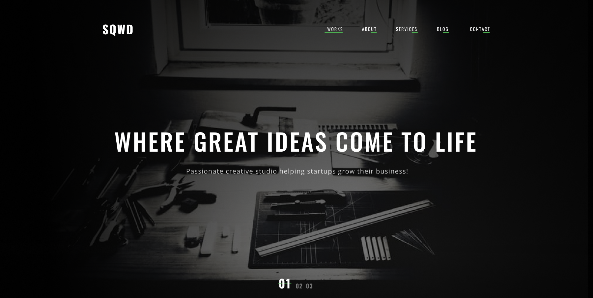

# SQWD Agency Landing

Одностраничный лендинг для вымышленного диджитал-агентства **SQWD**, разработанный на чистом **HTML** и **CSS** без использования JavaScript. Проект создан с целью демонстрации семантической вёрстки.

## 🖼️ Превью



## 🔗 Демо

**[Посмотреть онлайн](https://szubyrka.github.io/sqwd-agency-landing/)**

## 🚀 Особенности

- Чистый, валидный HTML5-код
- Стилизовано с использованием CSS3 (Flexbox, Grid)
- Без JavaScript
- Семантическая вёрстка
- Поддержка современных десктопных браузеров

## 📁 Структура проекта

```
├── index.html
├── style.css
├── assets/
│   ├── images/
│   └── fonts/
├── README.md
└── LICENSE
```

## 🛠️ Используемые технологии

- HTML5
- CSS3 (Flexbox, Grid)

## 📌 Заметки

- Проект создан исключительно в учебных и демонстрационных целях.
- Все изображения взяты из [макета в Figma](https://www.figma.com/file/kj9nSCo1ecFqlJ78QBmX92/Сайт-о-digital-агенстве?node-id=0%3A17&mode=dev).

## 📄 Лицензия

Этот проект распространяется под лицензией [MIT](./LICENSE).

## 📬 Контакты

Если хочешь связаться со мной:

- GitHub: [@szubyrka](https://github.com/szubyrka)
- Email: [szubyrka@gmail.com](mailto:szubyrka@gmail.com)
